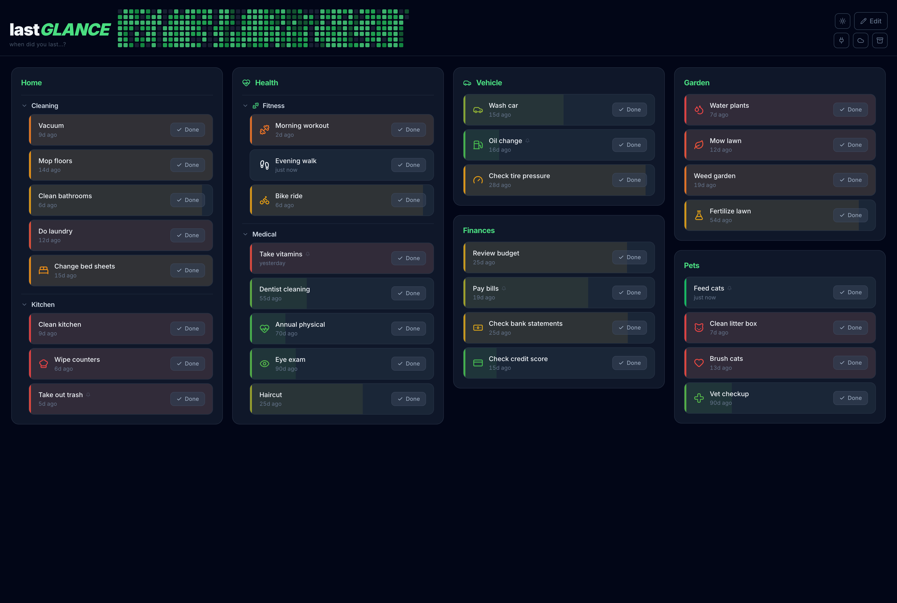
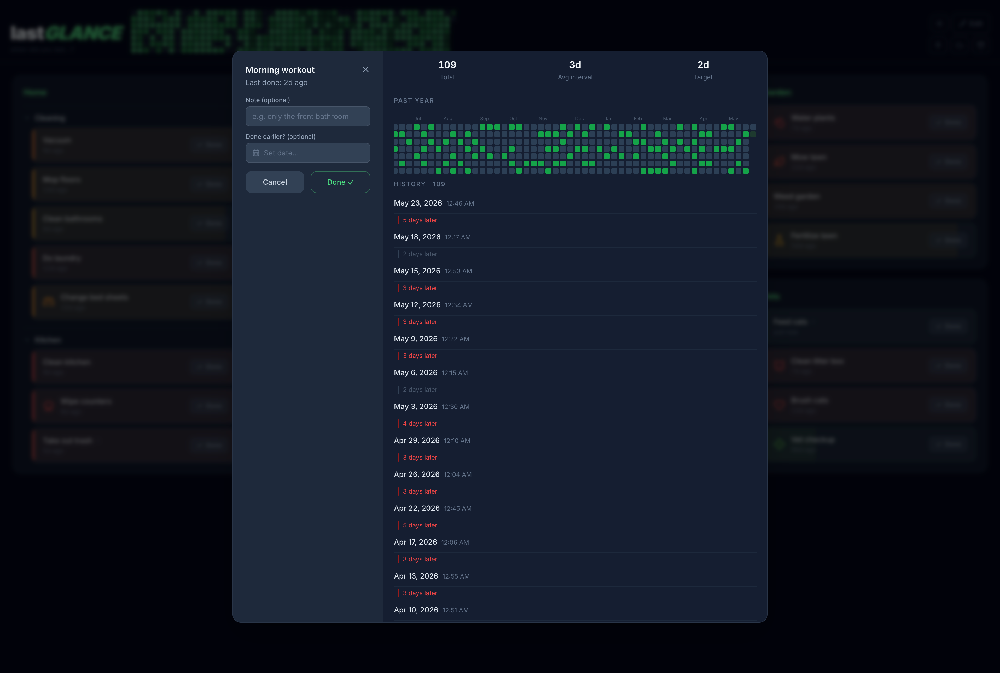

# lastGLANCE

**when did you last...?** A privacy-first recency tracker for the chores and upkeep that don't fit a calendar. Runs in your browser, with no account and no server unless you bring your own.

Part of the **GLANCE family**: focused, standalone apps connected through a shared intent protocol. See also [dayGLANCE](https://github.com/krelltunez/dayGLANCE) (today), lastGLANCE (recent upkeep), and [lifeGLANCE](https://github.com/krelltunez/lifeGLANCE) (your whole timeline).

[](../../releases)
[](LICENSE)

---



lastGLANCE is a chore-tracking progressive web app that answers one question: *when did I last do this?* It tracks recency, not schedules. The emotional register is information, not guilt.

---

## Features

- **Recency tracking**: each chore shows how long ago it was last done, encoded as a color gradient from fresh green through amber to red
- **Cadence**: set a target interval in days; overdue chores sort to the top automatically
- **Categories & subcategories**: organize chores into collapsible groups with custom icons
- **Freeform masonry layout**: category cards size to their content and arrange across columns; your spatial organization is preserved
- **Activity heatmap**: a GitHub-style contribution graph in the header gives an at-a-glance view of completion history
- **Completion history**: per-chore stats (total completions, average interval vs. target), a per-chore contribution graph, and a timestamped log with per-entry notes
- **Backdate entry**: log completions in the past to bootstrap history from day one
- **Reminders**: browser notifications when a chore is overdue (opt-in per chore)
- **Seasonal chores**: hide chores outside their active date range each year
- **Cloud sync**: keep data in sync across devices via WebDAV or Nextcloud (CRDT merge, end-to-end encryption optional)
- **Auto-backups**: periodic remote snapshots (hourly/daily/weekly) in a `backups/` subfolder alongside the sync file
- **dayGLANCE integration**: send overdue chores as tasks to dayGLANCE via WebDAV intents
- **PWA**: installable, works offline, auto-updates
- **Dark/light mode**



---

## Tech Stack

| Layer | Technology |
|---|---|
| UI | React 19, Tailwind CSS, Lucide icons |
| Local storage | Dexie (IndexedDB) |
| Sync | `@glance-apps/sync` (WebDAV CRDT engine) |
| Intents | `@glance-apps/intents` |
| Build | Vite 6, TypeScript |
| PWA | vite-plugin-pwa (Workbox) |
| Container | nginx (production), Docker |

---

## Quick Start

### Self-host with Docker

```bash
docker run -d \
  -p 3000:80 \
  --restart unless-stopped \
  ghcr.io/krelltunez/lastglance:latest
```

Or with Docker Compose:

```yaml
services:
  app:
    image: ghcr.io/krelltunez/lastglance:latest
    ports:
      - "3000:80"
    restart: unless-stopped
```

Available at `http://localhost:3000`.

### Self-host (static files)

```bash
npm install
npm run build
# Serve the dist/ folder from any static host (nginx, Caddy, Cloudflare Pages, etc.)
```

> **Note:** lastGLANCE makes WebDAV requests from the browser. If your WebDAV server does not allow cross-origin requests (CORS), you will need the WebDAV proxy (see [Configuration](#configuration)).

### Build from Source

```bash
npm install
npm run dev        # Vite dev server at http://localhost:5173
npm run build      # Production build -> dist/
npm run preview    # Preview production build locally
npm run lint       # ESLint
```

---

## Configuration

lastGLANCE is configured entirely in-app. One environment variable is available at build time:

| Variable | Required | Description |
|---|---|---|
| `VITE_WEBDAV_PROXY_URL` | No | Base URL of a [WebDAV CORS proxy](https://github.com/krelltunez/lastGLANCE/tree/main/api) to relay requests when the WebDAV server doesn't allow browser requests directly. Leave unset if your server has permissive CORS headers or you're using a reverse proxy that handles CORS. |

Create a `.env.local` for local development:

```env
VITE_WEBDAV_PROXY_URL=https://your-proxy.example.com
```

### WebDAV Proxy

The `api/` directory contains a lightweight server-side proxy (`webdav-proxy.js`) for deployments where CORS is a constraint. It accepts requests at `/api/webdav-proxy/?url=<encoded-target>` and forwards them to the target WebDAV server, stripping the `X-WebDAV-Auth` header into a standard `Authorization` header on the way out.

---

## Sync & Storage

All data is stored locally in IndexedDB (via Dexie). Cloud sync is optional and configured in-app under the **Cloud** button.

**Supported providers:**
- Generic WebDAV (pCloud, Seafile, self-hosted, etc.)
- Nextcloud (uses the native WebDAV endpoint)
- Koofr (self-hosted app recommended; Koofr blocks browser requests from Vercel-hosted origins)

**File layout on the server** (default folder `GLANCE/lastglance`, configurable in sync settings):
```
GLANCE/lastglance/
  lastglance-sync.json      <- live sync file
  backups/
    lastglance-backup-hourly-...json
    lastglance-backup-daily-...json
    lastglance-backup-weekly-...json
```

**Encryption:** end-to-end AES-256-GCM encryption is optional. When enabled, the sync file and all backup files are encrypted before upload. The passphrase never leaves the device, and there is no recovery mechanism, so store it somewhere safe.

---

## Integrations

### dayGLANCE

lastGLANCE can send overdue chores to [dayGLANCE](https://github.com/krelltunez/dayGLANCE) as scheduled tasks via the GLANCE intents protocol. Configure the integration under the **Plug** button.

Two delivery modes are available per chore:
- **Manual**: the -> dG button on a chore card sends it immediately
- **Auto**: the chore is sent once per day whenever it's overdue (requires the intents poller to be running)

---

## Data & Backups

- **Export**: download a full JSON backup at any time from the Archive menu
- **Import**: restore from a local JSON file (replaces all current data)
- **Remote restore**: browse and restore from any auto-backup on your WebDAV server
- **Clear sample data**: remove the example categories and chores from a fresh install (also offered in the welcome modal)

---

## Privacy

lastGLANCE has no backend, no analytics, and no accounts. All data is stored locally on your device. Cloud sync is optional, goes only to a server you control, and can be end-to-end encrypted so the server never sees plaintext.

---

## Contributing

Contributions are welcome. See [CONTRIBUTING.md](CONTRIBUTING.md) for how to run the app locally, project structure, pull request guidelines, and how to report bugs or security issues.

---

## License

[MIT](LICENSE): free to use, self-host, modify, and distribute.

---

## Support

If lastGLANCE has been useful to you, consider supporting its development:

[](https://github.com/sponsors/krelltunez)
[](https://ko-fi.com/krelltunez)
